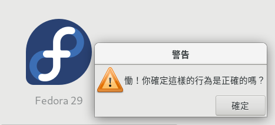
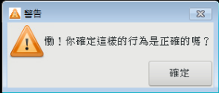
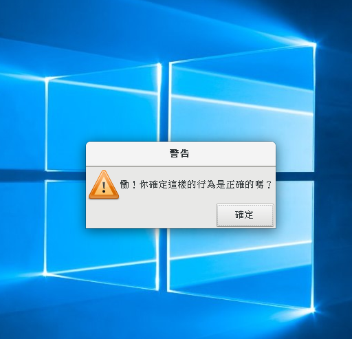

# GTK 3 Basic Practice





## Reference Resources
* GNOME GTK+ 3 Manual: https://developer.gnome.org/gtk3/stable/gtk-getting-started.html
* GNU Make Tutorial by jserv GUTS courses in HackMD: https://hackmd.io/s/SySTMXPvl

## MinGW compile note

* first, make icon for specific program:
    - dependencies: mingw version "windres", ImageMagicK "convert"

```sh
make mingw_icon
```

* then, make MinGW version binaries"
```sh
make mingw
```

* copy third-party bash script into works, work it:
```bash
cp mingw-copy-deps.bash work/
./mingw-copy-deps.bash /usr/i686-w64-mingw32/sys-root are_you_sure.exe  ## for example
```

### "Package" MinGW version in Linux

* Install 7-zip Win32 version (or grab related sfx file) in WINE and install p7zip in Linux
* use that version of "sfx" to make self-extract compress file:
```
7za a -sfx"$HOME/.wine/drive_c/Program Files/7-Zip/7zCon.sfx" work-current.exe work/
```
